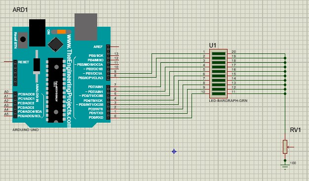

# Project 1: LED Sequence Controller

This project consists of three parts. All three parts share the same circuit design, so only one simulation file is provided for the entire project.  
The circuit connects **10 LEDs** to an Arduino board, and the LEDs will be turned on and off in different patterns in each part.

---

## Part 1: Sequential On and All Off

In this part, the LEDs turn on **one by one** from the first to the last LED.  
As soon as the last LED lights up, **all LEDs turn off simultaneously**.

---

## Part 2: Forward and Reverse Sequence

Here, the LEDs turn on **one by one** from the first to the last LED.  
When the last LED is lit, the sequence reverses and the LEDs turn on **one by one from the last back to the first**.

---

## Part 3: Opposite Ends to Center

In the final part, the LEDs turn on starting from **both ends simultaneously**, moving towards the center.  
Once the center LEDs are lit, the LEDs turn off **one by one in sequence**.

---

## Circuit Overview

The circuit uses Arduino digital output pins connected to LEDs with appropriate current-limiting resistors.  
The simulation file demonstrates the behavior described above and can be run in Proteus.

---

## How to Run

1. Load the Arduino source code into Arduino IDE.
2. Generate the `.hex` file by compiling (shortcut: `Ctrl + Alt + S`).
3. Load the `.hex` into the Arduino component in Proteus simulation.
4. Run the simulation to observe the LED patterns.

---

If you have any questions or suggestions, feel free to open an issue or pull request.
