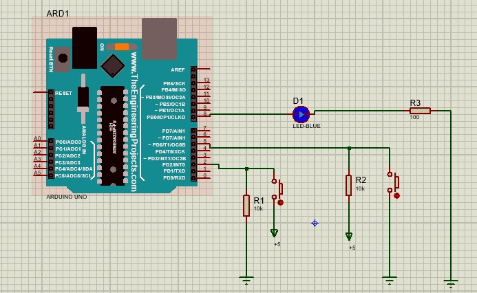

# Project 1
This project consists of 3 parts:

## Part 1:
 

In this part of the project, the LED should be turned on by pressing one key and turned off by pressing another key.

## Part 2:
...

## Part 2:
...