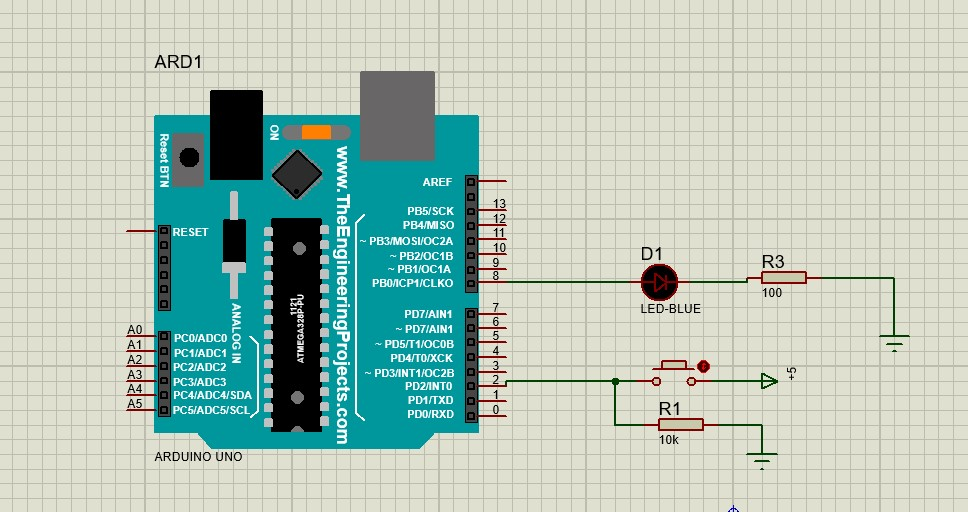

# Project 2
این پروژه نیز شامل سه بخش می باشد که هر کدام مدار خاص خودش را دارد:

## بخش 1:

در این بخش، ما یک LED به پایه شماره 8 متصل کردیم
همچنین با استفاده از مدار های pull-up و pull-down، دو ورودی به برد می دهیم.
در این بخش باید با فشردن یک دکمه لامپ روشن و با فشردن دکمه دیگر لامپ خاموش شود.

## بخش 2:

در این بخش از پروژه، ما برای ورودی فقط از یک دکمه استفاده کرده ایم. و قرار است که با فشردن دکمه لامپ روشن شود، و تا زمانی که دست بر روی دکمه است، لامپ روشن بماند.
به محض اینکه دستمان از روی دکمه برداشته شد، لامپ خاموش  بشود.

## بخش 3:

مدار این بخش هم به مانند مدار بخش دوم است، با این تفاوت که در این بخش با فشردن دکمه، لامپ روشن، و با فشردن دوباره همان دکمه، لامپ خاموش شود.