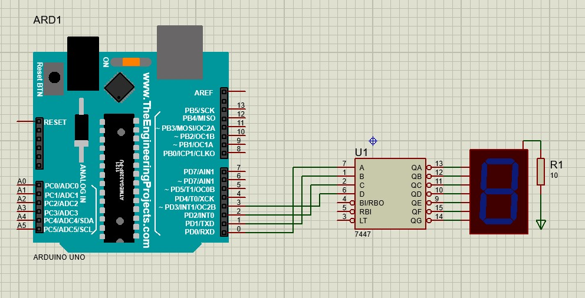

# Project 3
This project consists of 4 parts:

## Part 1:

In this part of the project, we need to build a single digit counter using ic7447 and a 7-segment.

## Part 2:
In this part of the project, we need to build a single digit counter using ic7447 and a 7-segment.
with the difference that with the increase of each unit "." Turn off and on once.

## Part 3:

In this part of the project, we have to make a two-digit counter using ic7447 and 7 segments.