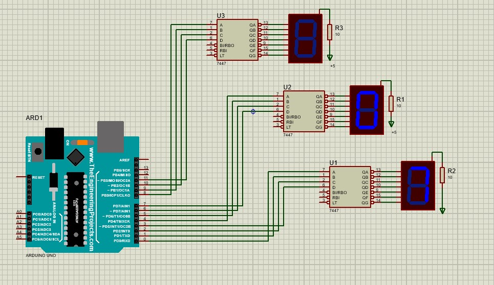

# Project 3
این پروژه شامل سه بخش است. ولی روند کلی این پروژه ساخت یک شمارنده با استفاده از سون سگمنت و ic7447 می باشد.

## Part 1:

در این بخش از پروژه، باید اعداد باینری را به عنوان خروجی برد آردوئینو تعیین کنیم. پس از اینکه این عدد باینری را به ic7447 می دهیم، این عدد باینری تبدیل به کد صفر و یک می شود که باعث می شود سون سگمنت آن عدد را نشان دهد.
در این بخش از پروژه فقط نیاز است که اعداد صفر تا 9 نمایش داده شود و پس از سیدن به عدد 9، دوباره شمارش شروع می شود.

## Part 2:
این بخش از پروژه، مداری مانند مدار بخش اول دارد با این تفاوت که با تغییر هر عدد، چراغ نقطه در سون سگمنت یک بار خاموش و روشن می شود.

## Part 3:

در این بخش از پروژه، باید یک شمارنده دورقمی را درست کنیم که از عدد صفر شروع شود تا 99 ادامه دهد.

## Part 3:

این بخش از پروژه هم باید شمارنده سه رقمی درست شود و از عدد 0 تا 999 را بشمارد.