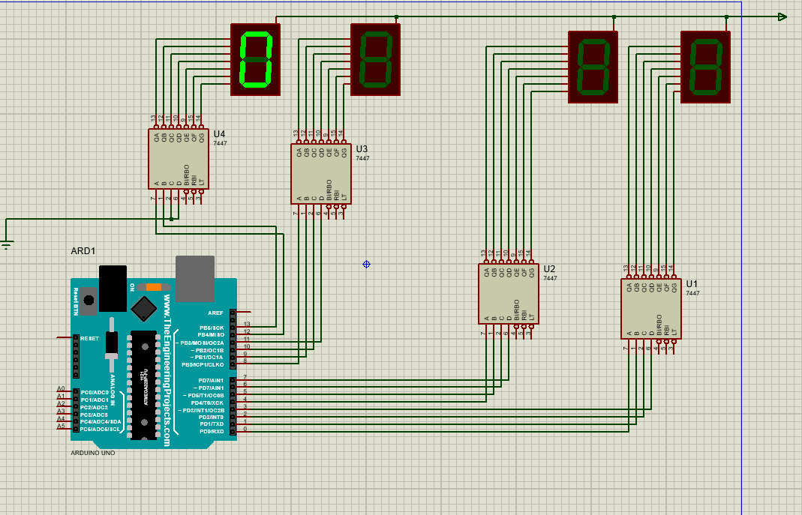

# Project 4: Advanced Seven-Segment Counters and Digital Clock

## Part 1: Two-Digit Counter Without IC7447

In this part, you will build a **two-digit counter** using seven-segment displays **without** the IC7447 decoder.  
Unlike the previous projects where IC7447 was used to convert binary input to seven-segment signals, here the Arduino directly outputs the required signals for each digit based on the seven-segment pin mapping.

Additionally, a **button** is connected as an input to the Arduino.  
Every time the button is pressed, the counter increments by one.

---

## Part 2: Digital Clock with Seven-Segment Displays

This project implements a **digital clock** that displays hours and minutes with minute precision.  
- The **two rightmost** seven-segment displays show the **minutes**.  
- The **two leftmost** seven-segment displays show the **hours**.

The clock updates accordingly to show the current time as it counts.

---

## How to Run

1. Load the Arduino code for the desired part into the Arduino IDE.
2. Compile and generate the `.hex` file (shortcut: `Ctrl + Alt + S`).
3. Import the `.hex` file into the Arduino component within the corresponding Proteus simulation file.
4. Run the simulation and observe the counter or clock behavior on the seven-segment displays.

---

Feel free to reach out for questions or contributions!