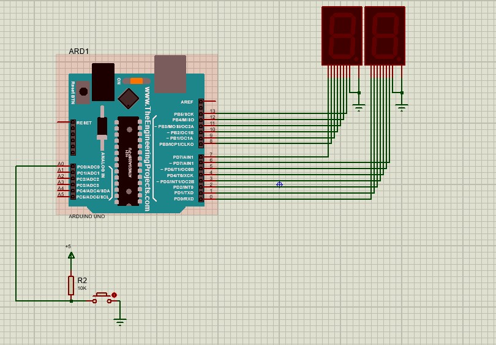

# Project 4
در این بخش از پروژه باید یک شمارنده دو رقمی با استفاده از سون سگمنت درست کنیم. تفاوت این پروژه با پروژه قبلی در این است که در این پروژه از ic7447 استفاده نشده است.
برای راه اندازی این پروژه، کافیست با استفاده از راهنمای سون سگمنت، به جای خروجی عدد باینری، فقط کافیست یه خروجی متناسب با سون سگمنت را برای برد آردوئینو تعیین کنیم.
همچنین در این پروژه، یک ئکمه به عنوان ورودی به برد داده شده است. که با فشردن دکمه، یک رقم به شمارنده اضافه می شود.

