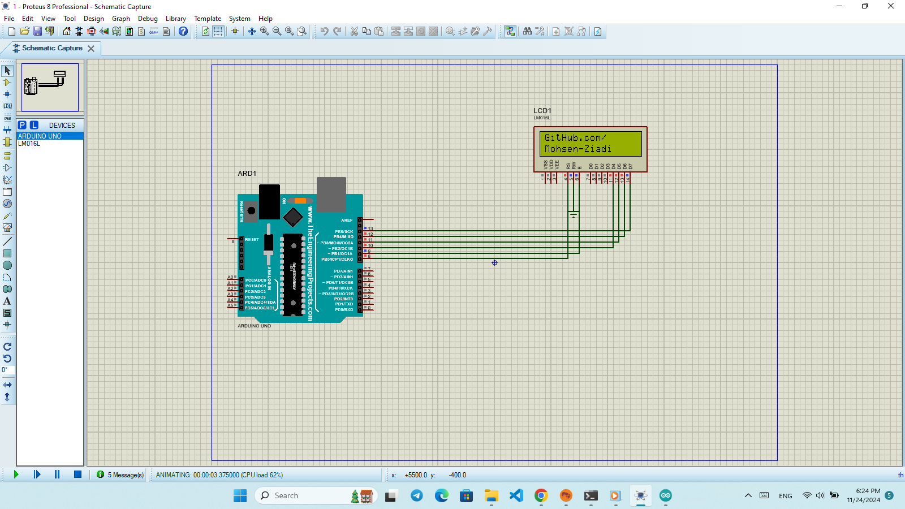

# Project 5: Displaying Text on an LCD

---

## Part 1: Custom Text on LCD

In this part, an **LCD screen** is connected to the Arduino board.  
The goal is to display **custom text** on the LCD using the built-in `LiquidCrystal` library.

You can modify the code to show any message you'd like.

---

## Part 2: 

---

## How to Run

1. Open the provided `.ino` file in the Arduino IDE.
2. Upload the code to your Arduino board.
3. Run the Proteus simulation and observe the LCD displaying the custom message.

Make sure the connections follow the correct pin mapping between the Arduino and the LCD (usually RS, EN, D4-D7).

---

