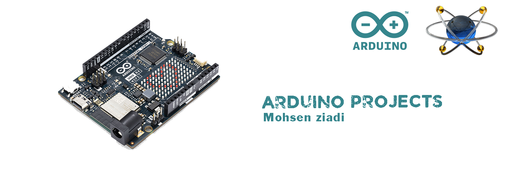

# Ardunio--AzDigitalSystem-2

In this repository there are different projects with Arduino board.

## setup
To start the projects, you must first download the Arduino library for the Proteus software.
> [DOWNLOAD Arduino library File](./files/Arduino%20files/library.zip "download")

After downloading the compressed file of the Proteus library, unzip it and you will have two files in it.
The names of these two compressed files of the Proteus library are as follows:
1. ArduinoTEP.LIB
2. ArduinoTEP.IDX

Copy the first file and place it in the following path:
```
C:\Program Files (x86)\Labcenter Electronics\Proteus 8 Professional\DATA\LIBRARY
```

Copy the second file and place it in the following path:
```
C:\Program Files (x86)\Labcenter Electronics\Proteus 8 Professional\DATA\Library Indexing
```

After installing the library, we go to the Arduino file:
1. There, you compile the file in binary form by pressing (Alt + Ctrl + S) buttons.
2. Then in the Proteus software, by clicking on the Arduino board, you select the (.hex) file.
    (the same files that were created after compilation)
3. Run Proteus
